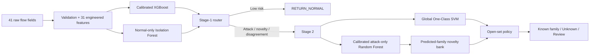

# NETRA

## Hybrid Network Intrusion Detection

Sentiflow is a two-stage IDS created through supervised, clustering, anomaly-detection, feature-selection, and open-set experiments. It combines calibrated classification with novelty evidence, allowing it to return Normal, a known attack family, an unknown-attack candidate, or analyst review instead of forcing uncertain labels.

> Results use a fixed held-out split. Unknown attacks are approximated with leave-one-family-out tests; temporal and genuinely unseen attacks are still required for production validation.

## Architecture



## Data and Activities

The dataset has **125,973** flows: 67,343 Normal, 45,927 DoS, 11,656 Probe, 995 R2L, and 52 U2R. The imbalance makes macro-F1, balanced accuracy, per-family recall, false-positive rate, and review coverage more meaningful than accuracy alone.

Completed work includes EDA, attack-family/target construction, correlation and outlier analysis, 31 deterministic behavioral features, supervised and unsupervised benchmarks, supervised/unsupervised feature selection, normal-only anomaly models, attack novelty testing, calibrated routing, MLflow tracking, reusable inference, FastAPI, Streamlit, Docker, tests, and notebook/deployment parity validation.

## Experiments and Outcomes

| Experiment | Compared | Main outcome |
|---|---|---|
| [`Experiment.ipynb`](Notebooks/Experiment.ipynb) | 6 binary classifiers | XGBoost won: test F1 **99.9275%**, recall **99.9062%**, 6 FP / 11 FN |
| Five-class classification | Same 6 models | Showed detection and family classification should be separated |
| Attack-only classification | Same 6 models | Random Forest won: macro-F1 **0.9832**, balanced accuracy **0.9687** |
| [`Feature_Selection_Experiment.ipynb`](Notebooks/Feature_Selection_Experiment.ipynb) | 17 selector/model combinations | Boruta + XGBoost: 53/72 features, F1 **99.9232%** |
| [`Experiment2.ipynb`](Notebooks/Experiment2.ipynb) | K-Means, DBSCAN, Agglomerative, GMM | DBSCAN mapped F1 **0.9175**, well below supervised XGBoost |
| [`feature_selection_unsupervised.ipynb`](Notebooks/feature_selection_unsupervised.ipynb) | 20 combinations | Laplacian + DBSCAN led at F1 **0.9403** with 48 dimensions |
| [`feature_selection_Anamoly_Detection.ipynb`](Notebooks/feature_selection_Anamoly_Detection.ipynb) | 15 anomaly/representation combinations | Correlation + Isolation Forest: F1 **0.9510** |
| [`Anamoly Detection.ipynb`](Notebooks/Anamoly%20Detection.ipynb) | Global, family, tuned, stacked anomaly models | Stacked macro-F1 only **0.4820**; novelty retained as a safety gate, not classifier |
| Global attack novelty | IF, LOF, One-Class SVM in 4 LOFO folds | One-Class SVM: balanced accuracy **0.9187**, pseudo-unknown recall **0.8451** |
| Category novelty | 3 models × 4 families | DoS/R2L/U2R use One-Class SVM; Probe uses Isolation Forest |

EDA and feature engineering are documented in [`EDA.ipynb`](Notebooks/EDA.ipynb). Engineered features cover traffic volume/direction, connection concentration, scan pressure, error history, authentication, privilege, and content risk. Production formulas are centralized in `src/features.py`.

### Why these models became final

- XGBoost supplied the strongest stable binary evidence.
- Clustering was useful for discovery but weak on rare attacks.
- Correlation-selected Isolation Forest supplied independent Normal novelty.
- Attack-only Random Forest best classified known families.
- One-Class SVM best rejected withheld attack families.
- Family-specific novelty models outperformed one universal family detector.
- Rare-class uncertainty motivated conservative review decisions.

## Final Methodology and Results

[`Hybrid.ipynb`](Notebooks/Hybrid.ipynb) reserves data before fitting:

| Fit | Reference | Validation | External test |
|---:|---:|---:|---:|
| 70,544 | 15,117 | 15,117 | 25,195 |

Reference data calibrate novelty; validation data learn policies; test data are evaluated once. Stage-1 thresholds are `xgb_low=0.007929`, `xgb_high=0.110088`, `novelty_high=0.991092`, and `novelty_extreme=0.999876`.

| Final metric | Result |
|---|---:|
| Stage-1 automatic coverage / accuracy | **99.53% / 99.92%** |
| Known attacks routed to Stage 2 | **99.93%** |
| Known-attack acceptance / review | **96.67% / 3.30%** |
| Accepted-category accuracy / macro-F1 | **1.0000 / 1.0000** |
| Known-attack false unknown | **0.00%** |
| Overall review rate | **1.91%** |

Accepted coverage by family was DoS 97.56%, Probe 94.85%, R2L 82.30%, and U2R 0%. All six U2R test rows went to review—safer than a forced label, but evidence that more rare-attack data are required.

Final MLflow runs: Stage 1 `009e649215464979b79cc2bd206e8119`; Stage 2 `21a3a7a638014352bbc52678c02f79e9`.

## Run

```powershell
# API (docs: http://127.0.0.1:8000/docs)
.\.venv\Scripts\python.exe -m uvicorn api.main:app --host 127.0.0.1 --port 8000

# UI (http://localhost:8501)
.\.venv\Scripts\python.exe -m streamlit run ui\app.py

# Or both with Docker
docker compose up --build
```

See [`api/README.md`](api/README.md) and [`ui/README.md`](ui/README.md).

## Train, Infer, Track, and Verify

```powershell
.\.venv\Scripts\python.exe -m src.training_pipeline Data\Consolidated_df.csv artifacts\hybrid
.\.venv\Scripts\python.exe -m src.inference_pipeline input.csv predictions.csv --print-model-info
.\.venv\Scripts\mlflow.exe ui --backend-store-uri "sqlite:///Notebooks/mlflow.db"
.\.venv\Scripts\python.exe -m src.validate_notebook_parity --output artifacts\parity_report.json
.\.venv\Scripts\python.exe -m unittest api.test_api -v
```

The checked-in parity report confirms all 31 features, both stages, and final decisions matched on 1,000 saved notebook outputs.

## Limitations

- Leave-one-family-out novelty is not proof of zero-day detection.
- R2L/U2R estimates have high variance.
- Results need temporal, external, duplicate, and leakage audits.
- Selective accuracy must be reported with coverage/review rates.
- Thresholds must reflect SOC capacity and be recalibrated under drift.
- Only trusted joblib artifacts should be loaded.

The core design principle is **selective prediction**: accept well-supported decisions, retain independent novelty evidence, and escalate uncertainty instead of hiding it behind an overconfident label.
